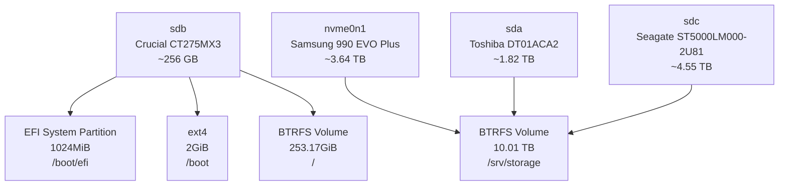
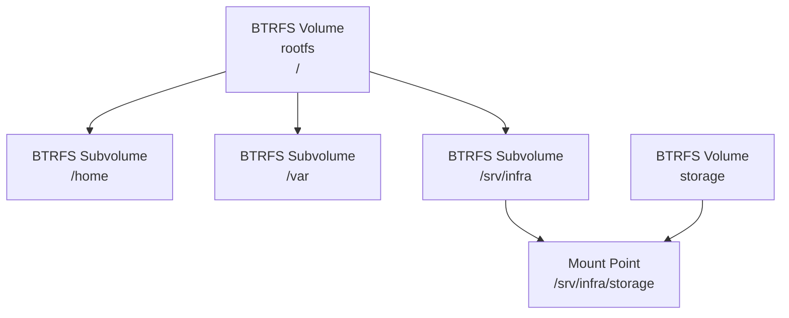

###### Storage Layout

```mermaid
flowchart TD

    SSD["sdb<br>Crucial CT275MX3<br>~256 GB"]
    SSD --> EFI["EFI System Partition<br>1024MiB<br>/boot/efi"]
    SSD --> BOOT["ext4<br>2GiB<br>/boot"]
    SSD --> ROOT["BTRFS Volume<br>253.17GiB<br>/"]

    HDD1["sda<br>Toshiba DT01ACA2<br>~1.82 TB"]
    HDD2["sdc<br>Seagate ST5000LM000-2U81<br>~4.55 TB"]

    NVME["nvme0n1<br>Samsung 990 EVO Plus<br>~3.64 TB"]
    NVME --> POOL["BTRFS Volume<br>10.01 TB<br>/srv/storage"]
    HDD1 --> POOL
    HDD2 --> POOL
```

###### BTRFS Layout

```mermaid
flowchart TD

    ROOTFS["BTRFS Volume<br>rootfs<br>/"]
    ROOTFS --> HOME["BTRFS Subvolume<br>/home"]
    ROOTFS --> VAR["BTRFS Subvolume<br>/var"]
    ROOTFS --> INFRA["BTRFS Subvolume<br>/srv/infra"]
  
    STORAGE["BTRFS Volume<br>storage"]
    MOUNT["Mount Point<br>/srv/infra/storage"]

    INFRA --> MOUNT
    STORAGE --> MOUNT
```
